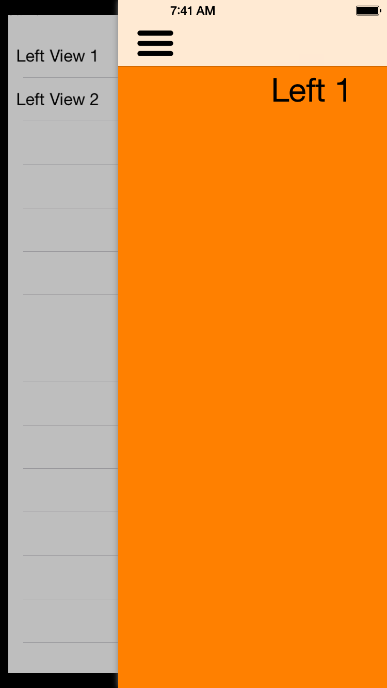
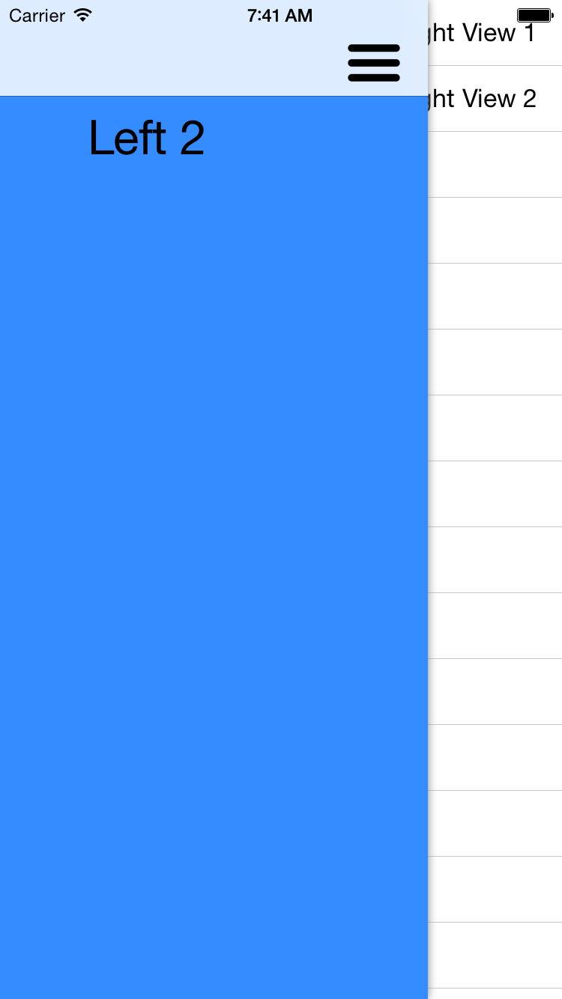
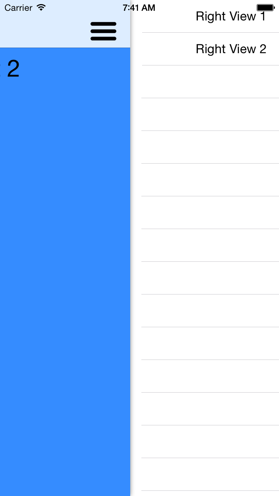

# TestAMSlideMenu

<br>

This project is just a POC to see how the AMSlideMenu control works (in Swift).  It's much better (IMHO) than the ECSliderPanel Control.  This provides a much better UX and it's much easier to implement.  The AMSlideMenu is swift compatable.

## AMSlideMenu
It's a Cocoapod, it's open source (MIT License):  https://github.com/SocialObjects-Software/AMSlideMenu

```ruby
pod "AMSlideMenu", "~> 1.5.4"
```

## Video Tutorial
My work here is based on a Youtube tutorial I found: https://www.youtube.com/watch?v=y33t_bWS_Zk

## Screenshots
A picture is worth a thousand words, right?







